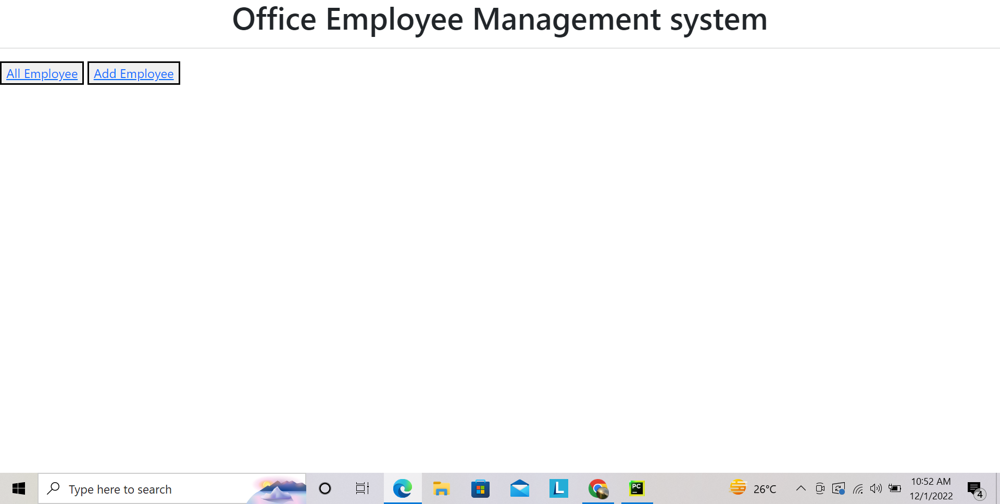
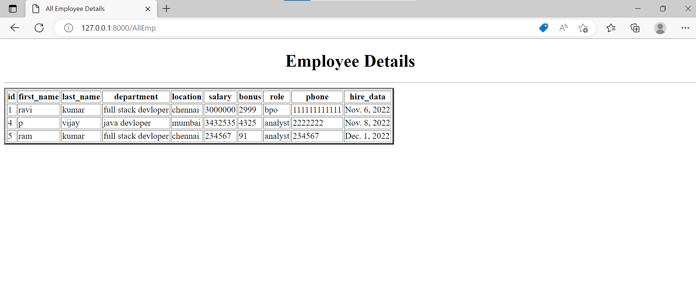
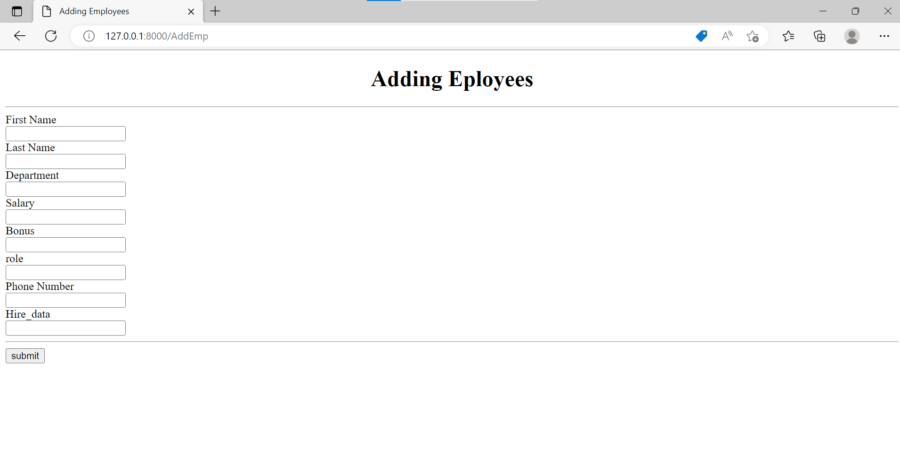

# Office Management system

this application is used to see te employee details and add employee in the table. 

## Table of contents

- [Overview](#overview)
  - [Screenshot](#screenshot)
  - [Links](#links)
- [My process](#my-process)
  - [Built with](#built-with)
  - [What I learned](#what-i-learned)
- [Author](#author)


## Overview
we have to install virtual environment and django,this will create a environment which helps to start devloping the application 
### Screenshot




### Links
- Solution URL: [Add solution URL here](https://your-solution-url.com)
- Live Site URL: [Add live site URL here](https://your-live-site-url.com)

## My process

### Built with

- HTML
- python

### What I learned
we have to create a project and app in django
- django-admin startproject project_name 
- django-admin startapp app_name
- it will provide the required files that will hhelp to devlop the application.
- manage.py--->settings.py-->urls.py-->veiws.py-->models or templates.
- in below code is a html page which is used to add the details of employee in the table 
```html
<!DOCTYPE html>
<html lang="en">
<head>
    <meta charset="UTF-8">
    <title>Adding Employees</title>
   
</head>
<body>
<center><h1>Adding Eployees</h1></center>
<hr>
<form action="/AddEmp" method="post">
    
    <label for="first_name">First Name</label><br>
    <input type="text" id="first_name" name="first_name" value="{{first_name}}"><br>
    <label for="last_name">Last Name</label><br>
    <input type="text" id="last_name"name="last_name" value="{{last_name}}"><br>
    <label for="department">Department</label><br>
    <input type="number" id="department"name="department" value="{{department}}"><br>
    <label for="salary">Salary</label><br>
    <input type="number"id="salary"name="salary" value="{{salary}}"><br>
    <label for="bonus">Bonus</label><br>
    <input type="number" id="bonus" name="bonus" value="{{bonus}}"><br>
    <label for="role">role</label><br>
    <input type="number" id="role" name="role" value="{{role}}"><br>
    <label for="phone">Phone Number</label><br>
    <input type="number" id="phone"name="phone"value="{{phone}}"><br>
    <label for="hire_data">Hire_data</label><br>
    <input type="text" id ="hire_data" name="hire_data" value="{{hire_data}}"><br>
    <hr>
    <button type="submit">submit</button>


</form>
</body>
</html>

```
```models
from django.db import models

# Create your models here.
class Department(models.Model):
    name = models.CharField(max_length=50, null=False)
    location=models.CharField(max_length=100)

    def __str__(self):
        return self.name

class Role(models.Model):
    name = models.CharField(max_length=50, null=False)

    def __str__(self):
        return self.name

class Employee(models.Model):
    first_name = models.CharField(max_length=30, null=False)
    last_name = models.CharField(max_length=30)
    department = models.ForeignKey(Department, on_delete=models.CASCADE)
    salary = models.IntegerField(default=0)
    bonus = models.IntegerField(default=0)
    role = models.ForeignKey(Role, on_delete=models.CASCADE)
    phone = models.IntegerField(default=0)
    hire_data = models.DateField()

    def __str__(self):
        return("%s %s %s"%(self.first_name,self.last_name,self.phone))
}
```
## Author

- Website - [github](https://github.com/pvijay037)
- [P vijay]


